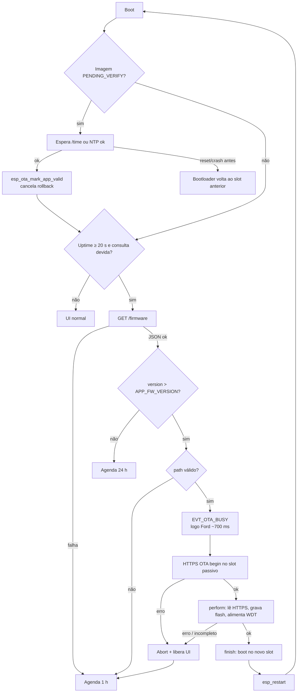

# Fluxo de atualização OTA

O ESP32 consulta o servidor HTTPS, compara um número de versão e, se houver firmware mais novo, grava no slot passivo e reinicia. O download corre no task `net` (core 0). O OLED mostra o logo da Ford antes da gravação, porque no ESP32 escrever flash trava o cache dos dois cores.

Host: `https://local-now-beta.vercel.app`

## Quando o dispositivo pergunta

`ota_client_poll()` só roda depois de um sync de relógio com sucesso (`/time` ou NTP). Na rede backup (4G), holdover **não** dispara OTA.

| Momento | Atraso |
|---|---|
| Graça após boot | 20 s (`APP_OTA_BOOT_GRACE_MS`) |
| Sem update disponível | próxima consulta em 24 h |
| Falha (404, JSON inválido, download) | nova tentativa em 1 h |
| Primeira confirmação pós-OTA | no primeiro `/time`/NTP ok |

Versão embutida no firmware: `APP_FW_VERSION` (hoje **1**), em `src/app/app_config.h`. O `PROJECT_VER` do CMake (`1.0.0`) é só o descritor da imagem ESP-IDF; a decisão de atualizar usa o inteiro.

## Rotas

| Método | Caminho | Quando | Tamanho típico |
|---|---|---|---|
| `GET` | `/firmware` | consulta (JSON) | < 200 B + TLS |
| `GET` | `/firmware.bin` | só se `version` > `APP_FW_VERSION` | ~1 MB + TLS |

O `path` do JSON é sempre concatenado ao host compilado:

```
https://local-now-beta.vercel.app + path
```

URL absoluta no JSON é ignorada. O path tem de começar com `/`, ter menos de 64 caracteres, sem `..`, só `[A-Za-z0-9/._-]`.

## Manifesto `GET /firmware`

Resposta **200**, `Content-Type: application/json`, corpo cabendo em 192 bytes.

```json
{
  "version": 2,
  "path": "/firmware.bin"
}
```

| Campo | Tipo | Obrigatório | Significado |
|---|---|---|---|
| `version` | inteiro > 0 | sim | Build remoto. Atualiza só se for **maior** que `APP_FW_VERSION` |
| `path` | string | não | Path do `.bin`. Default: `/firmware.bin` |

Exemplos que **não** atualizam:

```json
{"version": 1, "path": "/firmware.bin"}
```

```json
{"version": 0}
```

404, timeout ou JSON sem `version` → espera 1 h. Não há download do binário.

## Binário `GET /firmware.bin`

- HTTPS, certificado via bundle mbedTLS (mesmo stack de `/time`).
- Corpo: imagem ESP32 gerada pelo PlatformIO (`.pio/build/esp32dev/firmware.bin`).
- Timeout de leitura: 30 s.
- Gravação em fatias de ~1 KB (`bulk_flash_erase = false`), WDT alimentado a cada fatia.
- A imagem tem de caber no slot (1984 KB). O app atual ~1000 KB.

O `.bin` publicado precisa ser um firmware **novo** com `APP_FW_VERSION` igual ao `version` do manifesto (ou maior). Se o JSON disser `2` e o binário ainda tiver `APP_FW_VERSION 1`, o aparelho atualiza, confirma, e na consulta seguinte baixa de novo em loop. Incremente os dois juntos.

## Fluxograma



## Partições (flash 4 MB)

| Nome | Offset | Tamanho | Função |
|---|---|---|---|
| `nvs` | `0x9000` | 24 KB | NVS |
| `otadata` | `0xF000` | 8 KB | Qual slot está ativo |
| `phy_init` | `0x11000` | 4 KB | Calibração rádio |
| `ota_0` | `0x20000` | 1984 KB | App A |
| `ota_1` | `0x210000` | 1984 KB | App B |

A imagem nova vai sempre para o slot que **não** está rodando. A primeira gravação USB após mudar a tabela precisa de erase:

```bash
pio run -t erase
pio run -t upload
```

## UI e tasks

1. `net` seta `EVT_OTA_BUSY` e notifica `ui`.
2. FSM trava em logo / espera (oval Ford já está no GDDRAM do SSD1306).
3. `net` baixa e grava; `sup` ignora heartbeat da UI enquanto `EVT_OTA_BUSY`.
4. Sucesso → reset. Falha → limpa o bit e a UI volta ao ciclo.

Não há task extra para OTA.

## Publicar um update

1. Subir `APP_FW_VERSION` no código (ex.: `1` → `2`).
2. `pio run` e copiar `firmware.bin` para o host em `/firmware.bin`.
3. Servir `GET /firmware` com `{"version": 2, "path": "/firmware.bin"}`.
4. No próximo ciclo devido (ou em até 1 h se a consulta anterior falhou), o display baixa, grava, reinicia e confirma no primeiro sync.
